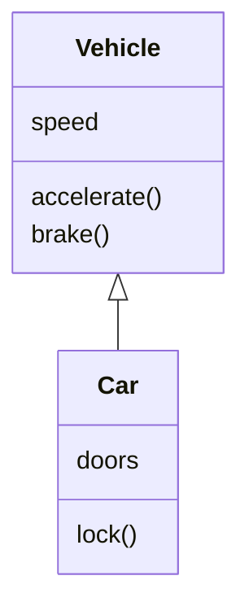

# Markdown-cheatsheet
A comprehensive cheatsheet for markdown

## Basics

| Formatting                                          | Syntax                                                         |
| --------------------------------------------------- | -------------------------------------------------------------- |
| **Bold**                                            | `**text**`                                                     |
| *Italic*                                            | `*text*`                                                       |
| ### Heading                                         | `#text //as many # as you want, subheaders the more # you add` |
| >  blockquote                                       | `>text`                                                        |
| 1. ordered list                                     | `1. text`                                                      |
| - unordered list<br>                                | `- text`                                                       |
| `code`                                              | `` `code text` ``                                              |
| codeblock                                           | ` ```language codeblock``` `                                   |
| Rule                                                | `----------`                                                   |
| [Link](https://www.youtube.com/watch?v=E4WlUXrJgy4) | `[text](URL)`                                                  |
| ~~Strikethrough~~                                   | `~~text~~`                                                     |
| ==Highlight==                                       | `==text==`                                                     |
| - [] task                                           | `- [] text`                                                    |
|                                                     |                                                                |

## Math

| Formatting                                  | Syntax                                        |
| ------------------------------------------- | --------------------------------------------- |
| $mathblock$                                 | `$math$`                                      |
| $\color{red}\text{colored math}$            | `$\color{color}math$`                         |
| $\text{text in math}$                       | `$\text{text}$`                               |
| $\displaystyle\sum_{k=1}  ^n$               | `$displaystyle\sum_{n=1} ^n$`                 |
| $\displaystyle\prod_{k=1}  ^n$              | `$\displaystyle\prod_{k=1}  ^n$`              |
| $a\cdot b$                                  | `$a \cdot b$`                                 |
| $a\times b$                                 | `$a \times b$`                                |
| $a \div b$, $a \colon b$                    | `$a \div or \colon b$`                        |
| $\pm / \mp a$                               | `$\pm or \mp a$`                              |
| $a^2$                                       | `$a^2$`                                       |
| $\sqrt[3]{a}$                               | `$\sqrt[3]{a}$`                               |
| $a\neq b$                                   | `$a \neq b$`                                  |
| $a \equiv b$                                | `$a \equiv b$`                                |
| $a \approx b$                               | `$a \approx b$`                               |
| $a \leq / \geq b$                           | `$a \leq or geq b$`                           |
| $\pi$                                       | `$\pi$`                                       |
| $[\dots],(\dots),\{\dots\}$                 | `$[\dots],(\dots),\{\dots\}$`                 |
| $67\degree$                                 | `$67\degree$`                                 |
| $\emptyset$                                 | `$\emptyset$`                                 |
| $\in$                                       | `$\in$`                                       |
| $\notin$                                    | `$\notin$`                                    |
| $\cup$                                      | `$\cup$`                                      |
| $\cap$                                      | `$\cap$`                                      |
| $\subseteq$                                 | `$\subseteq$`                                 |
| $\subset$                                   | `$\subset$`                                   |
| $\supseteq$                                 | `$\supseteq$`                                 |
| $\supset$                                   | `$\supset$`                                   |
| $\rightarrow$                               | `$\rightarrow$`                               |
| $\land$                                     | `$\land$`                                     |
| $\lor$                                      | `$\lor$`                                      |
| $\lnot$                                     | `$\lnot$`                                     |
| $\forall$                                   | `$\forall$`                                   |
| $\exists$                                   | `$\exists$`                                   |
| $\iff$                                      | `$\iff$`                                      |
| $\implies$                                  | `$\implies$`                                  |
| $\tilde{x}$                                 | `$\tilde{x}$`                                 |
| $\overline{x}$                              | `$\overline{x}$`                              |
| $\vec{v}$                                   | `$\vec{v}$`                                   |
| $\begin{pmatrix}4\cr5\cr6\cr\end{pmatrix}$  | `$\begin{pmatrix}4\cr5\cr6\cr\end{pmatrix}$`  |
| $\begin{bmatrix}1&2&3\cr4&5&6\end{bmatrix}$ | `$\begin{bmatrix}1&2&3\cr4&5&6\end{bmatrix}$` |
| $3^{12}$                                    | `$3^{12}$`                                    |
| $12 \over 783$                              | `$12 \over 783$`                              |

| Letter     | Syntax       | Letter     | Syntax       |
| ---------- | ------------ | ---------- | ------------ |
| $\alpha$   | `$\alpha$`   |            |              |
| $\beta$    | `$\beta$`    |            |              |
| $\gamma$   | `$\gamma$`   | $\Gamma$   | `$\Gamma$`   |
| $\delta$   | `$\delta$`   | $\Delta$   | `$\Delta$`   |
| $\epsilon$ | `$\epsilon$` |            |              |
| $\zeta$    | `$\zeta$`    |            |              |
| $\eta$     | `$\eta$`     |            |              |
| $\theta$   | `$\theta$`   | $\Theta$   | `$\Theta$`   |
| $\iota$    | `$\iota$`    |            |              |
| $\kappa$   | `$\kappa$`   |            |              |
| $\lambda$  | `$\lambda$`  | $\Lambda$  | `$\Lambda$`  |
| $\mu$      | `$\mu$`      |            |              |
| $\nu$      | `$\nu$`      |            |              |
| $\xi$      | `$\xi$`      | $\Xi$      | `$\Xi$`      |
| $\omicron$ | `$\omicron$` |            |              |
| $\pi$      | `$\pi$`      | $\Pi$      | `$\Pi$`      |
| $\rho$     | `$\rho$`     |            |              |
| $\sigma$   | `$\sigma$`   | $\Sigma$   | `$\Sigma$`   |
| $\tau$     | `$\tau$`     |            |              |
| $\upsilon$ | `$\upsilon$` | $\Upsilon$ | `$\Upsilon$` |
| $\phi$     | `$\phi$`     | $\Phi$     | `$\Phi$`     |
| $\chi$     | `$\chi$`     |            |              |
| $\psi$     | `$\psi$`     | $\Psi$     | `$\Psi$`     |
| $\omega$   | `$\omega$`   | $\Omega$   | `$\Omega$`   |

## Blocks
**math**
```Math
$$
A + B
$$
```

**Diagram**
``` `mermaid
classDiagram

Vehicle <|-- Car

class Vehicle{

speed

accelerate()

brake()

}

class Car{

doors

lock()

}
` ```


